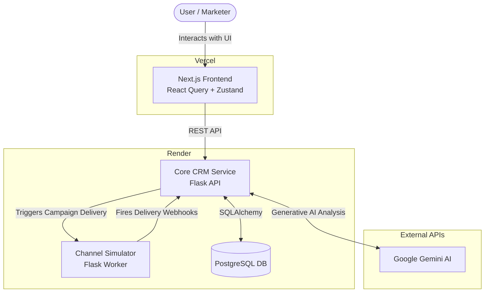
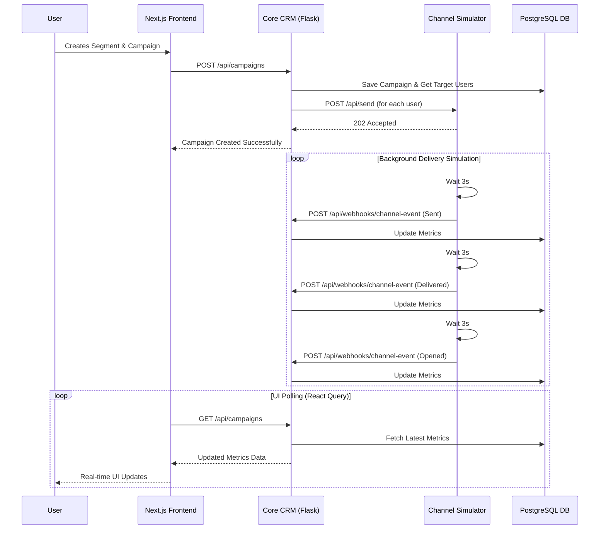

# AI-Powered Mini CRM Ecosystem

An intelligent, full-stack Customer Relationship Management (CRM) platform designed to orchestrate customer segments, predictive AI insights, and simulated multi-channel marketing campaigns. 

---

## 🏗️ Architecture Overview



The project is built on a modern, decoupled microservices architecture, separating the client interface, the core business logic, and third-party delivery simulations into distinct services.


### 1. Frontend Client (Next.js)
- **Framework:** Next.js 15 (React) with TailwindCSS
- **State Management:** Zustand (global store) + Tanstack React Query (server state & caching)
- **Key Features:** 
  - **AI Command Center:** A chat-based natural language interface to query CRM data, predict churn, and generate segments.
  - **Segment Builder:** A robust UI for building complex, multi-rule audience segments dynamically.
  - **Campaign Manager:** Create, review, and launch marketing campaigns targeting specific customer segments.
  - **Customer 360:** Detailed customer views featuring AI-generated churn risk scores, lifetime value predictions, and recommended actions.
- **Deployment:** Vercel

### 2. Core CRM Service (Python / Flask)
- **Framework:** Flask (RESTful API)
- **Database ORM:** SQLAlchemy connecting to PostgreSQL
- **AI Integrations:** Google Gemini (via `google-generativeai`) for generating JSON-structured insights, predictive scoring, and conversational AI responses.
- **Key Features:**
  - Manages the single source of truth for Customers, Orders, Segments, and Campaigns.
  - Listens for incoming Webhooks to update campaign delivery metrics in real-time.
- **Deployment:** Render (Web Service)

### 3. Channel Simulator Service (Python / Flask)
- **Framework:** Flask
- **Role:** Simulates an external messaging provider (like Twilio, SendGrid, or WhatsApp).
- **Key Features:**
  - Receives "send" requests from the Core CRM.
  - Spins up a background worker thread.
  - Simulates delays and fires sequential lifecycle webhooks (`sent` -> `delivered` -> `opened` -> `clicked`) back to the Core CRM's Webhook ingest endpoint.
- **Deployment:** Render (Web Service)

### 4. Database (PostgreSQL)
- **Engine:** PostgreSQL
- **Role:** Persistent storage for all entities.
- **Deployment:** Render (PostgreSQL Service)

---

## 🔄 Full Application Flow



### 1. Data Ingestion & Analysis
- When the CRM boots, customer profiles and historical order data are loaded from the database.
- The **AI Command Center** uses the Gemini API to analyze the database context, summarizing overall revenue opportunities, pinpointing high-risk churn customers, and suggesting personalized actions.

### 2. Segment Creation
- A user can create an audience segment either manually via the UI Rule Builder or by asking the AI (e.g., *"Find all users in Delhi who haven't purchased in 60 days"*).
- The Core CRM dynamically translates these rules into SQL/ORM queries, calculating the live audience size.

### 3. Campaign Orchestration
- The user creates a new Campaign, attaching a specific Message Template and targeting a previously created Segment.
- When the user clicks **"Launch Campaign"**, the Core CRM calculates the recipients and triggers an HTTP POST request to the **Channel Simulator Service** for each customer.

### 4. Delivery Simulation & Webhooks
- The **Channel Simulator Service** accepts the request and pushes it to a background thread.
- Over a series of simulated delays (representing real-world network and user interactions), the Simulator fires HTTP POST webhooks back to the Core CRM (`/api/webhooks/channel-event`).
- The Core CRM updates the campaign's metrics (Total Sent, Delivered, Opened, Clicked) in the PostgreSQL database.

### 5. Real-Time UI Updates
- Back on the Frontend, **React Query** periodically refetches (or invalidates) the Campaign data.
- The user sees the campaign progress bars and metrics dynamically update in real-time without refreshing the page.

---

## 🚀 Environment Variables setup

To run this project locally or in production, the following environment setups are required:

**Frontend (`.env.local` / Vercel)**
```env
NEXT_PUBLIC_API_URL=https://<YOUR_CRM_SERVICE_URL>/api
```

**Core CRM Service (`.env` / Render)**
```env
DATABASE_URL=postgresql://<user>:<password>@<host>/<db>
GEMINI_API_KEY=<your_google_gemini_key>
CHANNEL_SERVICE_URL=https://<YOUR_CHANNEL_SERVICE_URL>
PYTHON_VERSION=3.11.0
```

**Channel Simulator Service (Render)**
```env
CRM_SERVICE_URL=https://<YOUR_CRM_SERVICE_URL>
PYTHON_VERSION=3.11.0
```

---

## 🛠️ Local Development

1. **Database:** Ensure you have a local PostgreSQL instance running or connect to a cloud DB.
2. **Core CRM:** 
   ```bash
   cd backend/crm_service
   pip install -r requirements.txt
   python run.py
   ```
3. **Channel Service:**
   ```bash
   cd backend/channel_service
   pip install -r requirements.txt
   python run.py
   ```
4. **Frontend:**
   ```bash
   cd frontend
   npm install
   npm run dev
   ```
